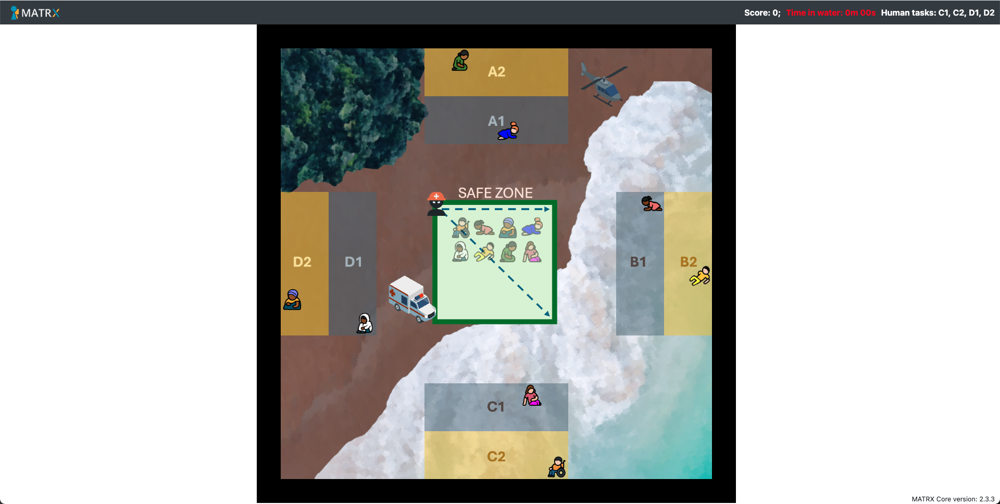

# Human-Robot Teamwork for Search and Rescue
This is the repository for a user study on willingness-based task allocation. The repository uses the [MATRX software package](https://matrx-software.com/) and forks [TUD-Collaborative-AI-2024](https://github.com/rsverhagen94/TUD-Collaborative-AI-2024) to create a simulated search and rescue task in a two-dimensional grid environment. You can find more information on installation and structure of the repository in the original repository.
The environment presents four areas A, B, C, and D, with two sub-areas, 1 and 2, each. Areas A and D are on dry ground whereas C and D are in water. Participants’ movement would be laggy in water, and it would also produce a safety beeping sound.

## Mission
here are two victims in each area (randomly assigned per mission) that need to be brought to the safe zone in the center, by either the human participant (wearing an orange hat) or the virtual robot. Participants have full visibility of the whole grid, and they can move freely, pick up and drop off any victim, using the keyboard. Victims need to be brought to the safe zone in a specific order: looking at the safe zone, victims should be brought in line by line, from top left to bottom right, as if one is reading in English. There is a time limit of five minutes per mission to bring all victims to the safe zone, but this is plenty to complete the mission.
#### Willingness
The task is designed to elicit a lower willingness for the sub-tasks in water.
Rooted on the idea that more effort and discomfort decrease a person's motivation towards a task, we made the team members' avatars lag when moving in the water, imitating what happens when we walk in water.
In addition, when the human participant is in the water, there is also a beeping sound, simulating a safety protocol.
This repetitive sound is intended to provoke mild discomfort, also decreasing the willingness towards going to water.
#### Score
There is a simple scoring system in place. For each victim dropped in the right place and order, the participant gets 5 points, while they would receive only 2 points for victims that were dropped in the right place but out of order.
